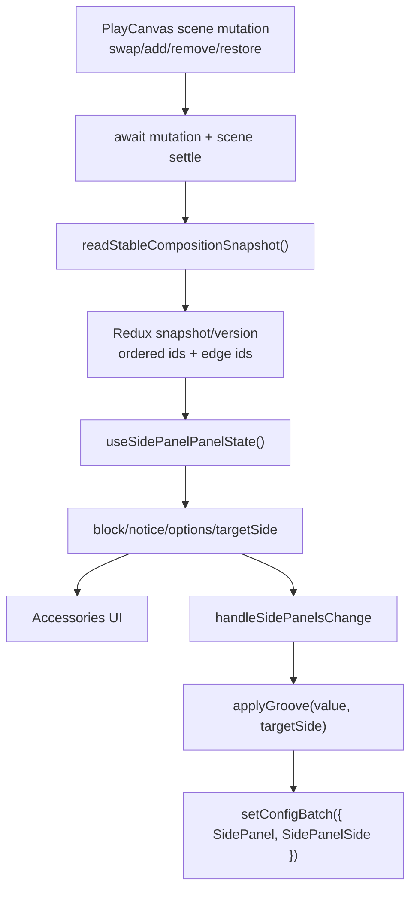

# Side Panel — data-driven реєстр причин (design + статус реалізації)

Рефактор шару «повідомлень/блоків» Side Panel + фідбек клієнта (A/B/C). Частину рішення вже **реалізовано в полегшеному вигляді** (див. розділ «Статус» і «Реалізовано»), частина лишається в «Заплановано далі».

Пов'язано: [side-panel-logic.md](./side-panel-logic.md).

> **Зовнішня довідка на PlayCanvas source.** Посилання виду
> `../../hasting-modular-playcanvas-flow-git/src/Scripts/app-configuration/...` ведуть у
> **сусідній репозиторій** `hasting-modular-playcanvas-flow-git` (лежить поряд із
> `hasting-modular-configuration/` під `Hasting-modular-config/`). Це не файли цього репо —
> якщо checkout-нуто лише `hasting-modular-configuration`, ці лінки локально не відкриються.
> Документований публічний контракт також є в репо: [`SIDE_PANEL_API.md`](../public/HastingCabinetsParametrization/files/assets/283626741/1/SIDE_PANEL_API.md).

## Контекст: фідбек клієнта

| # | Вимога |
| --- | --- |
| A | Повідомлення `Side panels can only be installed on edge cabinets.` має очищатися після in-player дії. Приклад 1: внутрішню SC посунули в кінець → повідомлення має зникнути. Приклад 2: для 3+ тумб після додавання 3-ї/4-ї і переходу на крок Side Panels інколи показується це повідомлення — не повинно. |
| B | Hard stop — лише якщо Open Shelf на **обох** кінцях vanity. Або якщо OSS на **обох** кінцях. |
| C | Текстова підказка: одна тумба → не показувати edge-only error; багато тумб → показувати зрозумілий target/edge feedback над робочою сіткою. |

Узгоджені рішення (від продукт-овнера):

- Застосування side panel при множинній конфігурації — **авто-fallback на валідний край** (`targetSide` = `"left"` / `"right"`, або `null` коли валідного краю нема), без вимоги ручного вибору краю.
- Тому текст з пункту C — це **не блок замість сітки**, а **підказка над сіткою**. Сітка лишається робочою.

## Статус

| Пункт / покращення | Статус |
| --- | --- |
| A — stale edge message після move/add | ✅ Реалізовано (effect-driven edge read, pull-модель) |
| B — hard stop лише для обох кінців | ✅ Працювало раніше; зафіксовано reason-codes |
| C — інформативний notice замість edge-only error | ✅ Реалізовано (`Applies to` + target side) |
| Auto-fallback `targetSide` + `null`-guard | ✅ Реалізовано (`resolveSidePanelTargetSide`) |
| Reason-codes замість string-equality | ✅ Реалізовано (часткове покриття — див. нижче) |
| Explicit single-cabinet `SidePanelSide:"both"` | ✅ Реалізовано |
| Push-snapshot helper / awaitable `swapProducts` / bridge event | ⛔ Заплановано далі |
| `useSidePanelPanelState` + `resolveSidePanelOptions`/`canApply` | ⛔ Заплановано далі |
| Окремий `resolveSidePanelTargetSide` | ✅ Реалізовано |
| Side-aware active state у grid | ✅ Реалізовано |
| Sync warning modal при зміні типу однієї side panel | ✅ Реалізовано |
| Reason-codes для option-level + notice (`exceeds-max-length`, `unsupported-groove`, `select-edge-cabinet`) | ⛔ Заплановано далі |
| Unit tests резолверів | ⛔ Немає node-test-раннера в репо |

Перевірка реалізованого: `npx tsc --noEmit` і `npm run build` — 0 TypeScript/build помилок. **Не закомічено**.

## Реалізовано (що фактично в коді)

### 1. `compositionVersion` + effect-driven edge read (фікс A)

- [slice.ts](../src/entities/product/model/store/slice.ts): поле `compositionVersion`, інкремент у reducer-ах `addProductId` / `insertProductIdRelative` / `removeProductId` / `swapProductIds` / `resetProducts` / `restoreProductState`. Селектор `getCompositionVersion` ([selectors.ts](../src/entities/product/model/store/selectors.ts)).
- В обох сторінках ([custom/index.tsx](../src/pages/custom/accessories/index.tsx), [prebuilt/AccessoriesPage.tsx](../src/pages/prebuilt/accessories/AccessoriesPage.tsx)) edge-state переведено з render-time `useMemo(getEdgeCabinets())` на **effect-driven** `useState`, що перечитує краї після осідання сцени: подвійний `requestAnimationFrame` + safety `setTimeout(250ms)`, keyed на `[isPlayCanvasReady, selectedProductOrderKey, compositionVersion]`. Це **pull-модель у сторінці** (не push-snapshot із handler-ів — див. «Заплановано далі»).

### 2. Реєстр причин (block + notice)

- Новий [sidePanelReasons.ts](../src/features/sidePanel/lib/sidePanelReasons.ts): `resolveSidePanelBlock` (порядок `length-340` p10 → `availability` p20), `resolveSidePanelNotice`, compatibility-хелпер `resolveSidePanelHint`, хелпери `isSidePanelLengthBlocked`, `formatSidePanelLength340Reason`, константи. Експортовано з [barrel](../src/features/sidePanel/index.ts).
- Новий [SidePanelNoticeBox](../src/features/sidePanel/ui/SidePanelNoticeBox.tsx): показує `Applies to: Left end / Right end / Both ends` і пояснює, куди реально буде застосовано вибір. Warning tone використовується, коли вибраний edge — OS/OSS і система fallback-ить на інший валідний край.
- Сторінки рахують `sidePanelReasonCtx` і рендерять: `block ? <msg> : (notice? + <Grid>)`. Стару error-формулювання «can only be installed…» прибрано; сітка лишається робочою, коли є валідний край або обидва валідні краї.

### 3. Auto-fallback `targetSide` + `null`-guard

- [sidePanelEdgeCompatibility.ts](../src/features/sidePanel/lib/sidePanelEdgeCompatibility.ts) має pure resolver `resolveSidePanelTargetSide`.
- `resolvedSpSide` в обох сторінках має тип `"left" | "right" | "both" | null`: валідний ручний вибір edge має пріоритет; якщо вибраний edge — OS/OSS, він **не** може стати target; якщо обидва краї валідні й вибрано interior/non-edge → `"both"`; якщо валідний тільки один край → `"left"`/`"right"`; якщо валідного краю нема → `null`.
- Empty click у PlayCanvas очищає `selectedSceneProduct`, тому UI переходить у no-cabinet-selected стан і не тримає старий left/right edge після кліку поза тумбою.
- Вибір фізичної side panel entity (`SidePanel_Left` / `SidePanel_Right`) мапиться на відповідний `targetSide` для керування конкретною бічною панеллю.
- `handleSidePanelsChange`: ранній `if (resolvedSpSide === null) return;` — `applyGroove` ніколи не отримає `null`. `computeTotalAfterSpChange` трактує `null` як «нічого не додаємо».

### 4. Reason-codes (структуровані замість string-equality)

- [options/types.ts](../src/features/configurator-rule-core/options/types.ts): тип `SidePanelReasonCode` + поле `reasonCode?` у `SidePanelAvailabilityResult`. Message = presentation, code = control flow.
- Заповнення: [selector](../src/features/sidePanel/model/selectors.ts) (`syntesi-countertop`), [sidePanelRules.ts](../src/features/sidePanel/lib/sidePanelRules.ts) (`open-shelf` / `side-shelf`), [sidePanelEdgeCompatibility.ts](../src/features/sidePanel/lib/sidePanelEdgeCompatibility.ts) (`bothEdgesBlockedReasonCode`: `both-open-shelf` / `both-side-shelf` / `mixed-open-side-shelf`).
- Заміна крихких порівнянь: сторінки — `reasonCode === "syntesi-countertop"`; edge-compat — `isShelfSidePanelReasonCode` замість порівняння рядків. Старий `isShelfSidePanelReason` лишено для зворотної сумісності.

### 5. Explicit single-cabinet `SidePanelSide:"both"`

- [sidePanels.ts](../src/utils/functions/playcanvas/sidePanels.ts): видалено legacy `setSidePanelSingle` (`{ SidePanel }` без сторони). `setSidePanel` завжди йде через explicit-side API; для `cabinetCount === 1` форсує `"both"`. Прибрано залежність від PlayCanvas `cabinetId`-fallback.

### 6. Side-aware active state + sync modal

- [sidePanelSelectionState.ts](../src/features/sidePanel/lib/sidePanelSelectionState.ts): `resolveSidePanelGridActiveValue` показує активність відповідної сторони (`left` / `right`) або aggregate-активність для `both`.
- Якщо одна сторона вимикається через `None`, але інша лишається `active`, [applyGroove](../src/features/sidePanel/lib/sidePanelService.ts) не скидає глобальний `SidePanels` у `None`.
- `resolveSidePanelSyncPrompt` відкриває [SidePanelSyncConfirmModal](../src/features/sidePanel/ui/SidePanelSyncConfirmModal.tsx), коли користувач міняє groove однієї сторони, а інша сторона теж active і може прийняти цей groove. Confirm застосовує `SidePanelSide:"both"`.

## Що було до рефактору (проблема)

Логіка «яку причину показати» була розмазана по 4 місцях і **продубльована** між custom і prebuilt:

1. **Обчислення** 340-блоку + рядка-причини (дубль у кожній сторінці).
2. **Каскад ternary у JSX** з неявним пріоритетом `340 > availability.reason > non-edge > grid`.
3. **Guard у `handleSidePanelsChange`** (ті самі умови імперативно).
4. **Фільтр опцій `sidePanelOptions`** (340 / Syntesi / not-allowed / exceed-max).

Проблеми: один і той самий пріоритет у 6 копіях → дрейф custom/prebuilt; пріоритет неназваний; змішані panel-level і option-level причини; edge-state читався під час рендеру → stale-повідомлення.

### Корінь пункту A (stale message)

Потік move ([PlayCanvasIntegration.tsx](../src/widgets/Player/components/PlayCanvasIntegration/PlayCanvasIntegration.tsx)):

```ts
swapProducts(idA, idB);              // PlayCanvas reorders — АСИНХРОННО (waitForFrames)
dispatch(swapProductIds({idA,idB})); // Redux order — СИНХРОННО → React re-render
await new Promise(r => setTimeout(r, 0));
await enforceSidePanelEligibilityForEdgeCabinets();
```

`dispatch(swapProductIds)` змінював `selectedProductOrderKey` → render-time memo перерахувався **негайно**, але `getEdgeCabinets()` ще читав **стару** композицію PlayCanvas → `isEdgeCabinet` лишався `false` → повідомлення «застрягало». Фікс — перенос на effect із перечитуванням після осідання (розділ «Реалізовано» п.1).

## До / Після

| | Було | Стало |
| --- | --- | --- |
| Пріоритет причин | неявний (вкладеність ternary) | явний `priority: number` (block-реєстр) |
| Копій block/notice-логіки | 6 (JSX+guard+filter × 2) | 1 реєстр; guard/filter ще inline (див. Future) |
| Edge message після move/add | stale | свіжий (effect-driven) |
| Non-edge у multi | error «can only be installed…» | notice `Applies to ...`, сітка робоча |
| Non-edge у single | міг показувати error | notice `Both ends`, apply explicit `"both"` |
| Порівняння причин | string-equality на message | `reasonCode` (структуровано) |
| `targetSide` для interior | неявний / міг падати в `"both"` без edge-check | `"both"` якщо обидва краї SBSC; один валідний край; або `null` (+guard) |
| Single-cabinet apply | legacy `{ SidePanel }` | explicit `{ SidePanel, SidePanelSide:"both" }` |

## PlayCanvas contract (зовнішня довідка)

Правильний шлях — **explicit side API**, а не legacy `cabinetId`. Джерела — публічний [`SIDE_PANEL_API.md`](../public/HastingCabinetsParametrization/files/assets/283626741/1/SIDE_PANEL_API.md) (у цьому репо) + source сусіднього PlayCanvas-репо.

- `ConfiguratorAPI.setConfigBatch({}, { SidePanel, SidePanelSide })`, де `SidePanelSide` ∈ `"left" | "right" | "both"`.
- Пріоритет у [`product-config.plugin.mjs`](../../hasting-modular-playcanvas-flow-git/src/Scripts/app-configuration/bridge/plugins/product-config.plugin.mjs): `config.SidePanelSide` → legacy `options.cabinetId` → default `"both"`. Legacy `cabinetId` для non-edge cabinet тихо стає `"both"` + warning — **небезпечно** для Side Panel UI (тому п.5 у «Реалізовано» прибирає цю залежність).
- На React боці [`setConfigBatch.ts`](../src/utils/functions/playcanvas/setConfigBatch.ts) має queue → послідовні writes; видалення `"None"` з `"both"` робиться двома side-calls ([sidePanels.ts](../src/utils/functions/playcanvas/sidePanels.ts)).

### 1 cabinet vs 2+ cabinets

Дві фізичні addon-entities: `SidePanel_Left`, `SidePanel_Right`. Зв'язок із тумбами залежить від кількості.

- **1 cabinet:** [`getEdgeCabinets()`](../../hasting-modular-playcanvas-flow-git/src/Scripts/app-configuration/domain/composition/composition-manager.mjs) повертає `leftCabinetId === rightCabinetId`. `SidePanelSide:"both"` створює дві панелі, синхронізовані з одним reference cabinet (PlayCanvas тести CAB-21, SP-12). → у моделі: `cabinetCount === 1 || leftCabinetId === rightCabinetId ⇒ targetSide = "both"`, notice не показувати.
- **2+ cabinets:** різні ids; `SidePanel_Left` ↔ лівий edge, `SidePanel_Right` ↔ правий. Interior cabinets не мають прямого binding → resolver дає `"both"`, коли обидва edge валідні, або конкретну сторону, коли валідний тільки один edge. Вибір фізичної side panel entity завжди мапиться на її сторону.

### Позиціювання vs config sync

- [`RuleSidePanels`](../../hasting-modular-playcanvas-flow-git/src/Scripts/app-configuration/domain/composition/rules/RuleSidePanels.mjs) ставить панелі по загальному AABB усіх cabinets.
- [`SidePanelAddon.buildConfig`](../../hasting-modular-playcanvas-flow-git/src/Scripts/app-configuration/domain/addons/side-panel-addon.mjs) бере `Depth/Height/CabinetColor/GrainDirection/HandleGrooveColor` з reference cabinet за стороною. Тому достатньо керувати `targetSide` — геометрію PlayCanvas розставить сам.

### Де ризик stale state

- [`getEdgeCabinets.ts`](../src/utils/functions/playcanvas/getEdgeCabinets.ts) / [`getOrderedProductIds.ts`](../src/utils/functions/playcanvas/getOrderedProductIds.ts) — синхронні snapshot-readers.
- [`swapProducts.ts`](../src/utils/functions/playcanvas/swapProducts.ts) — fire-and-forget; bridge [`product.plugin.mjs`](../../hasting-modular-playcanvas-flow-git/src/Scripts/app-configuration/bridge/plugins/product.plugin.mjs) не повертає Promise. Це головний сценарій stale після move. Поточний фікс (effect + `compositionVersion` + rAF/timeout) це обходить; чистіше було б awaitable bridge / event (Future).

## Заплановано далі (Future / не зроблено)

1. **Push-snapshot шар.** `src/utils/functions/playcanvas/compositionSnapshot.ts` з `waitForPlayCanvasFrames(2)` + `readStableCompositionSnapshot()`; зробити [`swapProducts.ts`](../src/utils/functions/playcanvas/swapProducts.ts) awaitable; після кожної mutation (`swap`/add/remove/restore) читати stable snapshot і dispatch-ити. Ідеально — bridge-метод `ConfiguratorAPI.getCompositionSnapshot()` і подія `onCompositionStructureChanged`, щоб прибрати rAF-евристику. Зараз — pull-модель у сторінці (працює, але euristика «осідання»).
2. **Спільний `useSidePanelPanelState`.** Звести block/notice/options/`canApply`/`targetSide` в один resolver + хук, щоб прибрати рештки дублю: зараз `sidePanelOptions`, `computeTotalAfterSpChange` і guard у `handleSidePanelsChange` досі inline і продубльовані між custom/prebuilt.
3. **Повне покриття reason-codes.** Енум `SidePanelReasonCode` уже має `exceeds-max-length`, `unsupported-groove`, `select-edge-cabinet`, але вони ще не прив'язані до option-level фільтра і notice. Додати `severity: "block" | "notice" | "option"` і `resolveSidePanelOptions(ctx)`, що віддає коди замість message-порівнянь.
4. **Unit tests резолверів.** У репо немає node-test-раннера (лише eslint + браузерний `__runTests`). Потрібен vitest (або браузерний suite) для test-matrix нижче.

### Цільова структура (коли робитимемо Future)

```ts
type SidePanelReasonSeverity = "block" | "notice" | "option";
type SidePanelTargetSide = "left" | "right" | "both" | null;

type SidePanelPanelState = {
  targetSide: SidePanelTargetSide;
  block: SidePanelResolvedReason | null;
  notice: SidePanelNotice | null;
  options: SidePanelOption[];
  canApply: (value: string) => boolean;
};

// pure functions
resolveSidePanelTargetSide(ctx)
resolveSidePanelBlock(ctx)      // ✅ вже є (block-частина)
resolveSidePanelNotice(ctx)     // ✅ вже є
resolveSidePanelOptions(ctx)    // ⛔ Future
canApplySidePanelValue(ctx, v)  // ⛔ Future
```

Render (ціль, спільний для custom/prebuilt):

```tsx
{state.block ? (
  <p>{state.block.message}</p>
) : (
  <>
    {state.notice && <SidePanelNoticeBox notice={state.notice} />}
    <ProductOptionsGrid data={state.options} handleAdd={handleSidePanelsChange} activeValue={activeSidePanels} />
  </>
)}
```

### Архітектура (ціль)



## Test matrix (специфікація)

`targetSide` по випадках:

| Case | `targetSide` | UI |
| --- | --- | --- |
| 0 cabinets | `null` | no apply |
| 1 cabinet / `leftCabinetId === rightCabinetId` | `"both"` | grid, без notice |
| 2+, вибрано лівий edge SBSC | `"left"` | grid |
| 2+, вибрано правий edge SBSC | `"right"` | grid |
| 2+, interior, обидва edge SBSC | `"both"` | grid + notice `Both ends` |
| 2+, interior, лише лівий edge SBSC | `"left"` | grid + notice `Left end` |
| 2+, interior, лише правий edge SBSC | `"right"` | grid + notice `Right end` |
| 2+, вибрано OS/OSS edge, інший edge SBSC | інший edge | grid + warning notice |
| targetSide left, left inactive, right active | `activeValue = "None"` | right status не підсвічує left workflow |
| targetSide right, right active | `activeValue = SidePanels` | показує right active |
| targetSide both, one side active | `activeValue = SidePanels` | active, бо хоча б одна сторона active |
| targetSide both, both sides inactive | `activeValue = "None"` | inactive |
| targetSide left/right, other side active + value changes + other side can accept value | confirm modal | confirm applies `"both"` |
| both edges OS | `null` | hard stop (`both-open-shelf`) |
| both edges OSS | `null` | hard stop (`both-side-shelf`) |
| mixed OS/OSS на обох | `null` | hard stop (`mixed-open-side-shelf`) — поки трактуємо як блок |
| Syntesi countertop | apply blocked | hard stop (`syntesi-countertop`) |
| exact 340 cm | apply blocked | hard stop (`length-340`) |
| exceeds max length | option disabled | без hard stop |

Integration/manual:

- Move internal SC → edge → старе edge-only повідомлення зникає.
- Move edge SC → interior → notice оновлюється, сітка працює через fallback/`both`.
- Add 3rd/4th cabinet → крок Side Panels → нема stale edge-only error.
- Duplicate left/right → Redux order і PlayCanvas edge snapshot збігаються.
- Remove edge cabinet з активною Side Panel → enforce коректно прибирає/відновлює сторону.
- 1 cabinet з Side Panel → дві фізичні панелі.
- Multi-cabinet interior → apply кличе `SidePanelSide:"both"`, якщо обидва краї SBSC; або `"left"`/`"right"`, якщо валідний тільки один край.

## Acceptance criteria

- `Side panels can only be installed on edge cabinets.` більше не показується як hard-блок для нормального 3+ interior selection. ✅
- Після move left/right Side Panel state перераховується з поточних PlayCanvas-країв. ✅ (через effect + version)
- Hard stop лише для: exact 340 cm; Syntesi; both ends OS; both ends OSS; mixed OS/OSS (поки як блок). ✅
- Apply у multi-cabinet interior selection йде на `"both"`, якщо обидва краї SBSC; або на єдиний валідний edge, якщо інший край OS/OSS. ✅
- Custom і prebuilt рендеряться зі спільного резолвера (block/notice/targetSide). ⚠️ частково — options/guard ще дубльовані (Future п.2).
- Guard handler-а й disabled-опції збігаються з видимим UI. ⚠️ частково (Future п.4).

## Ризики

- Зберегти пріоритет `340 > availability` (інакше зміниться видимий текст). Захищається тестами резолвера.
- `targetSide` має бути обчислений до `applyGroove`; обидві сторінки вже використовують спільний `resolveSidePanelTargetSide`, але options/guard ще треба звести в один хук (Future п.2).
- Подвійний rAF + 250ms — евристика «осідання» композиції; надійніше прив'язатись до bridge-події `onCompositionStructureChanged` (Future п.1).
- Mixed OS/OSS на обох краях зараз трактується як hard stop. Логічно випливає з вимоги B, але якщо клієнт буквально дозволяє mixed — змінити reason/тест.

## Відкрите питання для клієнта

Чи фінальний copy для `SidePanelNoticeBox` має лишатися технічним (`Applies to Left end/Right end/Both ends`), чи клієнт хоче коротший текст без пояснення fallback-у? Поточна реалізація свідомо показує target, щоб не було враження, що side panel ставиться на OS/OSS або interior cabinet.
