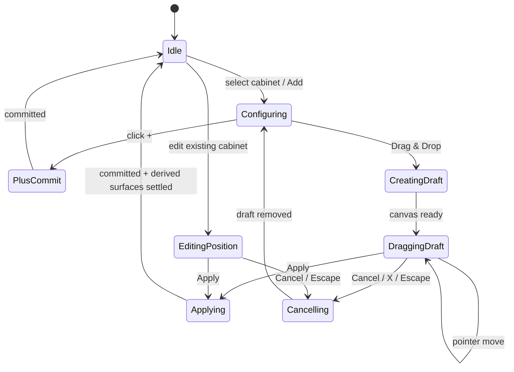

# Cabinet placement: plus, drag-and-drop, Apply/Cancel

Status: technical discovery and implementation contract
Primary collection: Urban Low Height (ULH)
Secondary collections: USH, Class, Mako

## 1. Goal

After the user selects a cabinet type, style and dimensions and presses `Add`, the UI must offer two placement paths:

1. `+` places the cabinet beside a selected anchor using the existing left/right logic.
2. `Drag & Drop` creates a movable draft cabinet. `Apply` commits its current position; `Cancel` removes the draft and restores the exact configuration that existed before the operation.

The same transaction model must later support editing the position of an existing cabinet:

- `Apply` keeps the new position;
- `Cancel` restores the cabinet's original position;
- cabinet identity, configuration and price ownership do not change while it is only being moved.

This document separates three concepts which are currently coupled:

- **selection**: cabinet parameters chosen in the React UI;
- **draft placement**: a visual entity being moved in PlayCanvas;
- **committed composition**: cabinets that participate in Redux identity, pricing, save/restore, history, countertop and cover calculations.

## 2. Current behavior

### 2.1 Selection and first cabinet

`CabinetBuilderPage` stores the selected type/configuration. When the scene is empty, `addSelectedCabinetToScene` currently creates the first product automatically after type and style are complete. It saves an undo snapshot first, calls `composition.addCabinet({ placement: { kind: "end" } })`, and immediately records the returned runtime id.

Relevant code:

- [`CabinetBuilderPage.tsx`](../src/pages/custom/cabinetBuilder/CabinetBuilderPage.tsx) — `addSelectedCabinetToScene` and `ENABLE_AUTO_ADD_FIRST_PRODUCT` effect.
- [`composition.ts`](../src/features/configurationCommands/lib/composition.ts#L327) — committed add command.

This conflicts with the requested UX. With the new flow, choosing parameters and pressing `Add` must enter a placement-choice state; it must not auto-commit the first cabinet. The empty scene already has a PlayCanvas empty plus-button mechanism, so both plus and drag placement can work without a previously placed anchor.

### 2.2 Existing plus placement

When `RightCabinetStyleSidebar` is open, it calls `setVisibleButtons(true)`. The buttons themselves are rendered inside the PlayCanvas iframe by `PlusButtonManager`. React installs a callback through `setHandleButtonClick`.

On plus click, the UI currently:

1. validates countertop length and chooses a fitting width;
2. removes an edge side panel when adding a side shelf;
3. pushes a history snapshot;
4. builds the product config with `buildAddedCabinetRequest`;
5. calls `composition.addCabinet` with `placement.kind = "beside"` and the anchor runtime id/side;
6. closes the sidebar after the scene confirms the add.

Relevant code:

- [`RightCabinetStyleSidebar.tsx`](../src/features/sidebar/ui/RightCabinetStyleSidebar/RightCabinetStyleSidebar.tsx#L612)
- [`buildAddedCabinetRequest.ts`](../src/features/sidebar/lib/buildAddedCabinetRequest.ts)
- [`setVisibleButtons.ts`](../src/utils/functions/playcanvas/setVisibleButtons.ts)
- [`setHandleButtonClick.ts`](../src/utils/functions/playcanvas/setHandleButtonClick.ts)

This path should remain the committed, immediate-add path. It should be refactored to share validation and config construction with drag placement, but its placement semantics do not need to change.

### 2.3 Composition command and identity

The committed add crosses these layers:

```text
React UI
  -> configurationCommands.composition.addCabinet
  -> playCanvasAdapter.ConfigurationCompositionPort.add
  -> sceneBridge.addProduct / setProductByParams
  -> window.ConfiguratorAPI
  -> PlayCanvas CompositionManager
  -> recordComposition(productIds)
  -> configuration listener syncCabinets(productIds)
  -> stable cabinet key (cab-N)
```

`product.productIds` is the current committed runtime-id list. `configuration.cabinets` mirrors it and assigns stable keys that survive save/restore. `recordComposition` also increments `compositionVersion`, which triggers scene-state reads and downstream rule recalculation.

Relevant code:

- [`composition.ts`](../src/features/configurationCommands/lib/composition.ts#L327)
- [`createCompositionPort.ts`](../src/features/playCanvasAdapter/lib/createCompositionPort.ts)
- [`sceneBridge.ts`](../src/utils/functions/playcanvas/sceneBridge.ts)
- [`compositionListeners.ts`](../src/features/configurationCommands/lib/compositionListeners.ts)
- [`configuration slice`](../src/entities/configuration/model/store/slice.ts)
- [`product slice`](../src/entities/product/model/store/slice.ts)

Consequently, a draft runtime id must not be dispatched through `recordComposition`. Doing so would make the draft a real cabinet everywhere in the application.

### 2.4 Existing PlayCanvas movement API

The current PlayCanvas export already exposes `window.ConfiguratorAPI.modules`:

- `getState(productId?)`;
- `isDragEnabled()`;
- `setDragEnabled(boolean)`;
- `setOffset(productId, { x, y })`;
- `resetOffset(productId)`;
- `whenSettled()`;
- `on("change", callback)` / `off(...)`.

Per-product state includes selection, dragging/moving state, offset in metres, collision, collision targets, order and spatial relations. The implementation stores the applied offset as `SpatialOffsetM`.

However, this API is not transactional:

- `gestureend` persists the current offset to the composition;
- `gesturecancel` also persists the current offset;
- `setOffset` persists immediately and notifies the composition aggregator;
- `resetOffset` restores `{x: 0, y: 0}`, not the position that existed when editing began;
- `addProduct` adds directly to the real composition and immediately runs layout/aggregation.

Therefore PlayCanvas `drag-cancel` means “the pointer gesture ended abnormally”, not “discard the user's placement operation”. It cannot implement the requested global `Cancel` button by itself.

Source: `CompositionModules` and `ModulesPlugin` in [`public/HastingCabinetsParametrization/js/esm.mjs`](../public/HastingCabinetsParametrization/js/esm.mjs).

## 3. Pricing today

### 3.1 Cabinet pricing

Pricing is derived from committed state by `usePriceCalculation`:

- Class and Mako use `buildCollectionPricingLines` and their collection SKU profile;
- USH-style pricing uses `buildPricingLines` and the shared SKU builders;
- every committed cabinet produces a stable pricing line (`cabinet:<runtimeId>`, or the relevant shelf group);
- `useSceneProductConfigs` reads config only for ids present in committed `productIds`;
- changed pricing lines are debounced by 300 ms before price requests are issued.

Relevant code:

- [`usePriceCalculation.ts`](../src/shared/hooks/usePriceCalculation.ts#L41)
- [`usePricingInput.ts`](../src/shared/hooks/usePricingInput.ts)
- [`useSceneProductConfigs.ts`](../src/shared/hooks/useSceneProductConfigs.ts)
- [`buildPricingLines.ts`](../src/shared/lib/pricing/buildPricingLines.ts#L269)
- [`buildCollectionPricingLines.ts`](../src/shared/lib/pricing/buildCollectionPricingLines.ts#L108)

Rule: **a draft cabinet must not enter `productIds`, `cabinetEntries`, `sceneConfigs` used by pricing, or pricing lines before Apply**. Otherwise cabinet price and total will change while the user drags and will generate unnecessary API requests.

### 3.2 Current top pricing

The current application models one aggregate countertop top:

- USH-style pricing sums cabinet widths, adds side-panel allowance and creates `countertop:0` with `widthCm`;
- Class/Mako collection pricing also sums all cabinet widths and creates one `countertop:0` line;
- basin, cutout and faucet-hole lines are separate.

This model assumes that one top spans the composition. It is not sufficient once `basinTop` and `cabinetCover` are separate physical surfaces.

### 3.3 Existing canvas support for top and cover

The current PlayCanvas export already distinguishes:

- `Top_Solid` with `CountertopRole: "basinTop"`;
- `Cabinet_Cover` with `CountertopRole: "cabinetCover"` and `generatedBy: "cabinet-cover-v1"`.

`Cabinet_Cover` is derived and read-only. It is generated from a cover plan and intentionally excluded from primary product serialization. Its plan contains segments with source cabinet ids, material, length/depth bounds and thickness. The public namespace is `window.ConfiguratorAPI.cabinetCover` with `configure`, `getState` and `whenSettled`.

Important current limitation: the cover adapter profile is `ulh-v1` and its source allow-list is ULH-specific. Class and Mako have countertop support anchors in the product registry, but they are not yet accepted by the cover-plan adapter. The first production implementation should therefore be ULH-scoped unless the canvas contract is deliberately expanded.

The React pricing layer currently has no `cabinetCover` pricing group, no cover SKU builder and no stable public pricing projection of cover segments. A generated `Cabinet_Cover` must never be mistaken for a normal cabinet or saved as a primary product.

## 4. Required behavior

### 4.1 UI state machine



Only one placement/edit session may exist at a time. Route changes, iframe reload, collection switch and unmount must cancel the active session safely.

### 4.2 Add through plus

- Reuse the current length, dimension, product-rule and side-shelf validations.
- Save one pre-change history snapshot.
- Commit through `composition.addCabinet` exactly as today.
- Wait for scene read/reconciliation before enabling another add.
- Price, save state, top and cover may update immediately after the committed add.

### 4.3 Add through drag-and-drop

On `Drag & Drop`:

1. Build exactly the same resolved cabinet config as the plus path.
2. Capture a baseline for history in memory, but do not push it yet.
3. Ask PlayCanvas to start a draft placement session.
4. Select the new entity, enable drag and expose canvas state to React.
5. Show `Apply` and `Cancel`; hide/disable conflicting actions, save, undo/redo, route-step changes and another add.
6. Keep current committed Redux composition and price unchanged while dragging.
7. Disable `Apply` when collision state is `colliding`, readiness is not `ready`, or the canvas reports an unsupported relation.

On `Apply`:

1. Freeze input and finish the current pointer gesture.
2. Canvas validates and commits the draft, including `SpatialOffsetM`.
3. Canvas runs composition aggregation once, then waits for countertop and cabinet-cover reconciliation.
4. React adopts the returned runtime id/order into the committed composition once.
5. React pushes the captured pre-change snapshot into history.
6. Stable identity, scene dimensions, pricing and save state update from that single commit.
7. Close placement UI only after both sides agree on the committed id/order.

On `Cancel`:

1. Canvas removes the draft entity and all draft-only handles/outlines.
2. Canvas restores selection and camera state where practical.
3. React discards the in-memory baseline without creating an undo step.
4. No product id, stable key, price line, saved configuration or derived surface may change.

### 4.4 Edit/move an existing cabinet

Beginning edit captures:

- runtime id and stable key;
- original `SpatialOffsetM`;
- original order/neighbours;
- selection/camera state;
- one pre-change history snapshot held in memory.

Dragging may update only the visual draft pose. `Cancel` restores the exact captured offset/order, not `{0, 0}`. `Apply` persists the new pose while preserving runtime id and stable key, then runs one committed aggregation/repricing cycle.

Whether free movement is allowed to change logical order must be explicit:

- recommended v1: spatial offset does **not** silently reorder cabinets; order changes remain the existing swap/reposition command;
- a future snap-to-row operation may return an explicit new order, which React records atomically with the offset.

## 5. Required window API

The existing `modules` API remains useful as a low-level spatial state feed, but transaction ownership should live in PlayCanvas. Add a dedicated public facade instead of reconstructing private composition state from React:

```ts
type PlacementMode = "add" | "edit";

type PlacementState = {
  sessionId: string;
  mode: PlacementMode;
  status: "creating" | "ready" | "dragging" | "applying" | "cancelling" | "error";
  productId: string | null;
  offset: { x: number; y: number } | null;
  collision: "unknown" | "clear" | "colliding";
  collidesWith: string[];
  canApply: boolean;
  error?: { code: string; message: string };
};

window.ConfiguratorAPI.placement = {
  beginAdd(input: {
    productType: string;
    config: Record<string, unknown>;
    initial?: { anchorProductId?: string; side?: "left" | "right" };
  }): Promise<PlacementState>;
  beginEdit(input: { productId: string }): Promise<PlacementState>;
  getState(): PlacementState | null;
  apply(sessionId: string): Promise<{
    status: "applied";
    productId: string;
    order: string[];
    config: Record<string, unknown>;
  }>;
  cancel(sessionId: string): Promise<{ status: "cancelled" }>;
  whenSettled(): Promise<PlacementState | null>;
  on(event: "change", callback: (state: PlacementState | null) => void): () => void;
  off(event: "change", callback?: (state: PlacementState | null) => void): void;
};
```

Contract requirements:

- every method is idempotent for the same `sessionId`;
- stale sessions cannot commit after iframe reload or collection/composition change;
- `apply` resolves only after composition aggregation, `countertop.whenSettled()` and `cabinetCover.whenSettled()`;
- `cancel` resolves only after draft cleanup or baseline restoration;
- draft products are excluded from primary serialization and committed composition order;
- no React code reaches into `ConfiguratorAPI.config.compositionManager` for mutations;
- errors have stable codes (`PLACEMENT_NOT_READY`, `PLACEMENT_COLLISION`, `PLACEMENT_STALE_SESSION`, `PLACEMENT_PRODUCT_NOT_FOUND`, `PLACEMENT_APPLY_FAILED`).

This facade can internally reuse `CompositionModules`, selection and spatial collision infrastructure.

## 6. React/domain changes

### 6.1 New adapter and command

Add a typed bridge/port rather than calling the iframe directly from UI components:

```text
features/playCanvasAdapter/lib/createPlacementPort.ts
features/configurationCommands/lib/placement.ts
utils/functions/playcanvas/placementBridge.ts
```

The placement command owns the session lifecycle and is the only layer allowed to turn an applied canvas result into `recordComposition`. UI components consume command state and intents only.

Suggested application state:

```ts
type CabinetPlacementUiState =
  | { status: "idle" }
  | { status: "choosing"; request: ResolvedCabinetRequest }
  | { status: "active"; sessionId: string; mode: "add" | "edit"; productId: string | null; canApply: boolean }
  | { status: "settling"; sessionId: string; action: "apply" | "cancel" }
  | { status: "error"; message: string; recoverable: boolean };
```

Do not put the draft id in the existing product slice. It belongs only to placement UI/adapter state until Apply.

### 6.2 Shared request builder

Extract the current width fitting, countertop constraint, cabinet rules, side-shelf eligibility and `buildAddedCabinetRequest` inputs into one resolver. Plus and drag must receive the same `SceneCompositionProduct`; only placement strategy differs.

Side-panel mutation deserves special handling: do not auto-remove a side panel before a drag draft is applied. Compute it as a pending commit effect, then apply it atomically with successful placement. Cancel must leave panels untouched.

### 6.3 UI ownership

- `CabinetBuilderPage`: parameter selection and transition to `choosing`.
- `RightCabinetStyleSidebar`: displays the `+` and `Drag & Drop` choices; it must no longer own the full add transaction.
- `PlayCanvasIntegration`: subscribes to placement state and renders/positions canvas-adjacent `Apply`/local close UI if that UI stays in React; it should not implement business commit rules.
- PlayCanvas iframe: entity drag, collision, snapping, draft outline and authoritative pose.

Keyboard and accessibility:

- `Escape` = Cancel;
- `Enter` = Apply only when `canApply`;
- focus moves to Cancel/Apply controls when a session starts and returns to the initiating control when it ends;
- status/collision errors are announced through an `aria-live` region.

## 7. Top and cover pricing contract

Before implementing cover price, product/pricing owners must confirm the cover SKU rule and whether price is per segment, total covered length, area, or unit. The UI should not infer this from rendered mesh names.

Recommended public projection from canvas:

```ts
type SurfacePricingSegment = {
  id: string;
  role: "basinTop" | "cabinetCover";
  sourceCabinetIds: string[];
  materialId: string;
  lengthCm: number;
  depthCm: number;
  thicknessCm: number;
};
```

The pricing input should contain committed `surfaceSegments`. Then:

- `basinTop` uses the existing top/basin/cutout rules, with its actual segment length;
- `cabinetCover` produces new `cabinetCover:<segment-id>` lines with a new `cabinetCover` pricing group;
- summary labels show Top and Cabinet Cover separately;
- totals use only committed, settled segments;
- unsupported/missing cover SKU becomes an explicit pricing gap, not a zero-price line.

Until that contract exists, canvas may render covers but application pricing for them is incomplete.

## 8. Save, restore and history

Current save reads committed ids in composition order and calls `getConfig` for each. History does the same. Because `SpatialOffsetM` is stored in cabinet config, an applied position can survive restore if the restore path preserves that field.

Relevant code:

- [`collectSceneConfiguration.ts`](../src/features/saveConfiguration/lib/collectSceneConfiguration.ts)
- [`captureSnapshot.ts`](../src/entities/history/lib/captureSnapshot.ts)
- [`restoreSnapshot.ts`](../src/entities/history/lib/restoreSnapshot.ts)

Required changes/tests:

- placement session must block save/autosave until Apply or Cancel settles;
- draft ids must never appear in saved `orderedProductIds`;
- applied `SpatialOffsetM` must be covered by round-trip tests;
- history baseline is pushed only after successful Apply;
- Cancel creates no history entry;
- undo after drag-add removes the committed cabinet;
- undo after edit restores the exact former offset;
- generated `Cabinet_Cover` remains derived and is recreated from saved cover settings plus committed cabinets.

## 9. Failure and race handling

- If iframe reloads during draft: cancel locally, discard the session, resync committed scene, show a recoverable message.
- If Apply fails before commit: keep the session active when safe; otherwise cancel and resync.
- If canvas commits but React recording fails: mark runtime out of sync and request authoritative scene sync; do not retry add.
- If cover/top settling fails after cabinet commit: cabinet remains committed, Save is blocked, and the UI shows a derived-surface error with retry.
- Double-clicking Apply/Cancel must execute once.
- Collection/route changes must await cancel; they must not leave an invisible draft entity.
- A selected side shelf must still obey edge-only rules; free drag cannot bypass product constraints.

## 10. Implementation sequence

1. **Contract tests in PlayCanvas**: add/edit draft isolation, Apply, Cancel, collision, stale session, iframe/composition teardown.
2. **Typed placement bridge and port**: no UI yet; fake-port tests for all result states.
3. **Shared cabinet request resolver**: make plus and drag use identical resolved config and validation.
4. **Placement command/state machine**: in-memory history baseline, committed adoption on Apply, resync on partial failure.
5. **UI controls**: placement choice, Apply/Cancel, disabled states, keyboard/focus, mobile pointer behavior.
6. **Edit-position entry point**: reuse the same transaction with an existing product id.
7. **Derived surfaces**: wait for top/cover barriers and expose committed surface segments.
8. **Cover pricing**: SKU contract, pricing lines/gaps and Summary presentation.
9. **Save/restore/history tests**: `SpatialOffsetM`, no drafts in payload, derived cover recreation.
10. **Collection rollout**: ULH first; enable USH/Class/Mako only after their canvas eligibility and pricing contracts pass the same suite.

## 11. Acceptance matrix

| Scenario | During drag | Apply | Cancel |
| --- | --- | --- | --- |
| Add first cabinet | No committed product/price | One cabinet, one history step | Empty scene |
| Add beside cabinet | Existing price unchanged | Correct order/id/price | Original composition |
| Add side shelf | Panels unchanged | Edge rule + pending panel change committed | Panels unchanged |
| Edit existing | Stable id/key, price unchanged | Same id/key, new offset | Exact original offset |
| Collision | Apply disabled | Cannot commit | Original composition |
| Top extension | Existing top price unchanged | Recomputed after settle | Original top |
| ULH cover | Existing cover price unchanged | Cover segments regenerated/priced | Original cover |
| Save during session | Blocked | Enabled after settle | Enabled after cleanup |
| Iframe reload | Session invalidated | No duplicate | Committed scene resynced |

## 12. Decisions still required

1. Exact cover SKU and pricing unit (segment, length, area or unit).
2. Whether `Apply` is allowed for a free, non-snapped but collision-free cabinet.
3. Whether free dragging may change logical cabinet order in v1.
4. Whether Cancel keeps the selected cabinet parameters/sidebar open (recommended) or closes the add flow.
5. Whether the current first-cabinet auto-add is removed globally or retained behind a collection/experience flag.
6. Which collections launch drag placement initially. Based on current canvas cover support, ULH should be first.
