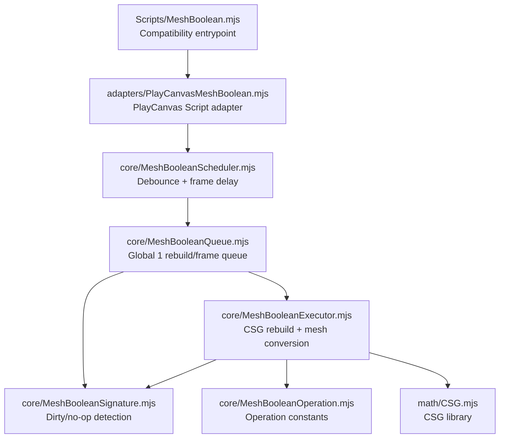
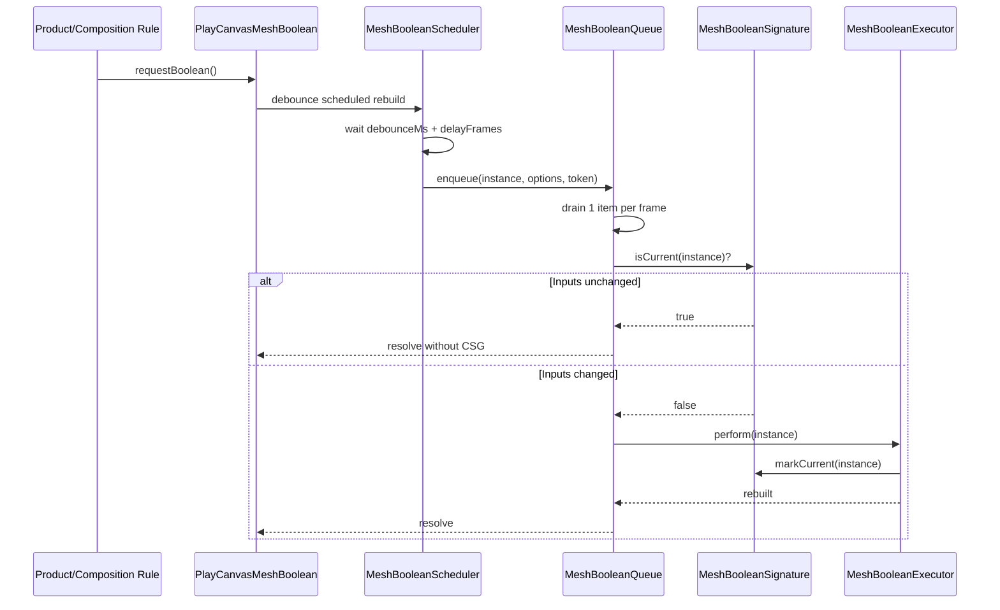

# Mesh Boolean Module

Reusable CSG-based boolean rebuild infrastructure for PlayCanvas configurators.

## Structure

- `core/` contains reusable scheduling, queueing, signature, and CSG execution logic.
- `adapters/` contains engine/runtime-specific integration code.
- `../../MeshBoolean.mjs` is a compatibility entrypoint for existing imports and PlayCanvas script registration.



## Runtime Flow



## Reusable Core

- `MeshBooleanExecutor.mjs` runs the CSG rebuild pipeline and mesh conversion.
- `MeshBooleanQueue.mjs` drains scheduled boolean rebuilds at one rebuild per animation frame.
- `MeshBooleanScheduler.mjs` debounces interactive updates and enqueues settled work.
- `MeshBooleanSignature.mjs` builds dirty/no-op signatures to skip unchanged rebuilds.
- `MeshBooleanOperation.mjs` defines boolean operation constants.

These files should avoid product-rule imports and project-specific configurator assumptions.

## PlayCanvas Adapter

`adapters/PlayCanvasMeshBoolean.mjs` is the PlayCanvas `Script` integration. It owns:

- script attributes and lifecycle;
- source mesh caching;
- runtime cutter resolution fallback;
- SmartStretch setter hooks;
- asset-load handling;
- debug keyboard trigger.

## Project-Specific Behavior

The adapter currently contains behavior that is specific to this configurator:

- `BoolBox` naming fallback for cloned cutter references;
- cutter parent enabled policy;
- SmartStretch integration;
- SPACE key debug rebuild.

Move these behind options/hooks before reusing this module in a configurator with different rules.

## Performance Features

- `requestBoolean()` coalesces frequent interactive stretch updates.
- The global queue prevents multiple scheduled CSG rebuilds from running in the same frame.
- Dirty signatures skip queued rebuilds when target/cutter inputs did not change.
- `window.__meshBooleanQueueStats` exposes `requested`, `enqueued`, `coalesced`, `run`, `skipped`, `noopSkipped`, and `maxQueueLength` for trace/manual checks.

## Verification

After changes to this module, verify:

- direct `performBoolean()` still works;
- rapid Width/Depth/Height changes settle to correct cutouts;
- disabled cutter parents are skipped correctly;
- destroying an entity during a pending resize does not throw;
- `noopSkipped` increases for repeated no-op queued rebuilds;
- Chrome trace does not show multiple scheduled CSG rebuilds in the same frame.

## Claude Review Prompt

Use this prompt when asking Claude to review MeshBoolean changes:

```text
You are reviewing a PlayCanvas MeshBoolean performance/refactor change.

Goal:
- Keep the existing PlayCanvas public behavior compatible.
- Move reusable boolean scheduling/queue/signature/execution logic into `Scripts/mesh-boolean/core/`.
- Keep `Scripts/MeshBoolean.mjs` as a compatibility wrapper.
- Avoid running heavy CSG/MeshBoolean work during frequent interactive stretch updates.
- Debounce scheduled boolean work, drain scheduled CSG at one rebuild per frame, and skip queued rebuilds when target/cutter inputs are unchanged.

Files to inspect:
- `Scripts/MeshBoolean.mjs`
- `Scripts/mesh-boolean/adapters/PlayCanvasMeshBoolean.mjs`
- `Scripts/mesh-boolean/core/MeshBooleanExecutor.mjs`
- `Scripts/mesh-boolean/core/MeshBooleanScheduler.mjs`
- `Scripts/mesh-boolean/core/MeshBooleanQueue.mjs`
- `Scripts/mesh-boolean/core/MeshBooleanSignature.mjs`
- `Scripts/mesh-boolean/core/MeshBooleanOperation.mjs`

Please review for correctness risks, not style preferences.

Check specifically:
1. Import/API compatibility:
   - Existing imports of `Scripts/MeshBoolean.mjs` still receive the same `MeshBoolean` PlayCanvas script class.
   - PlayCanvas script registration via `static scriptName = 'meshBoolean'` still works.

2. Direct rebuild compatibility:
   - Existing direct callers of `performBoolean()` still run synchronously/directly.
   - `runSafeBoolean`, operation setter, asset-load callback, and debug SPACE rebuild behavior are not accidentally changed.

3. Scheduler correctness:
   - Frequent `requestBoolean()` calls are debounced and coalesced.
   - Stale scheduled work is invalidated by token checks.
   - Pending promises resolve/reject in a sensible order when work is replaced, canceled, skipped, or fails.
   - `requestBoolean({ immediate: true })` still bypasses debounce safely.

4. Queue correctness:
   - The global queue dedupes by MeshBoolean instance.
   - No more than one scheduled CSG rebuild runs per animation frame.
   - Queue draining cannot get stuck after errors.
   - Destroy cleanup removes pending timers/queued work and does not leave callbacks that can crash later.

5. Dirty/no-op signature correctness:
   - Queued rebuilds are skipped only when operation, source mesh, target transform/stretch, cutter list/order, cutter parent enabled state, cutter mesh, and cutter transform/stretch are unchanged.
   - No false "current" result can skip a needed rebuild after Width/Depth/Height changes, cutter enable/disable, cutter replacement, source mesh change, or operation change.
   - `markCurrent()` is called only after a successful rebuild or a safe no-op path.

6. PlayCanvas adapter boundaries:
   - Product-specific behavior remains isolated in `adapters/PlayCanvasMeshBoolean.mjs`.
   - Core files do not import product rules or configurator-specific modules.
   - SmartStretch wrapping cannot recurse, duplicate-wrap the same property, or schedule CSG while executor is muting target stretch updates.

7. Performance intent:
   - Interactive stretch updates should schedule/coalesce CSG instead of running CSG on every update.
   - Repeated no-op queued requests should increment `window.__meshBooleanQueueStats.noopSkipped`.
   - Multi-cabinet scenes should no longer run several scheduled CSG rebuilds in the same frame.

Return:
- Verdict: safe to ship / ship with fixes / do not ship.
- Correctness bugs ordered by severity, with file and line references.
- Performance risks that remain after this fix.
- Manual verification checklist for PlayCanvas.
- Any small follow-up cleanup that is worth doing now versus later.
```
